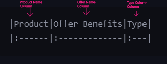
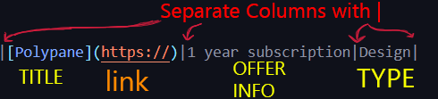
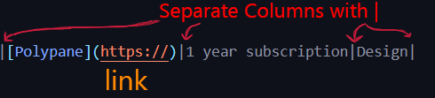
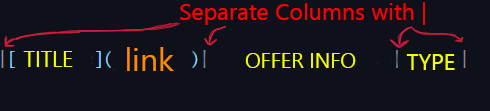

<p align="center">
  
</p>  


#

# <p align="center">ALL FREE Student Offers List
<p align="center">


</p>

#

## Offers List Is Here 👇
<details><summary> Click Here To Open List</summary>
<p>

###### CTRL/Command + F to Find anything  

<!--START_SECTION:cp-->

									   
<!--END_SECTION:cp-->


</p>
</details>  

#

# What is this ?

- **This a public database of all Student Offers Avialable**
- **Beginner friendly Repo For Starting Your Contribution Journey**
- **Feel Free to add more if I missed anything**
- **NEED CONTRIBUTORS FOR MAINTAIN THIS DATABASE**  
  
#

# How to Cotribute?

1. **Add a Star to this Repository**
2. **Fork The Repo**
3. **Open database.md from Database folder**
4. **Add/Modify/Replace What you want**
5. **Create A Pull Request**
6. **Explain what You Have Done in description**s

#

# What Contributions are accpected?

1. **Any Typo In The List of Offers**
2. **Adding More Offers Which is not Present**
3. **Adding Extra Genuine Information About the offer**
4. **Fixing Broken Links**
5. **If Any Offer is Not Working Anymore Mark It**
6. **If Link is not working, Adding it**
7. **Mentioning Duration Of The Offer**

#

# Instructions to Contribute :

- <details><summary> Basics of Markdown Table </summary>
  <p>

  - 
  - 

	
   </p>
   </details>  

- <details><summary> How To Add Links </summary>
  <p>

  -   
  
  - **Change/Replace the link**

  </p>
  </details>  

- <details><summary> How to Add An Offer </summary>
  <p>

   -   

   -
     ```bash
     [TITLE](https://)|OFFER INFO|TYPE|
     ```  

   - **Use the format**  

   - **add your own offer data**  

   - **add it at the end of the list**  

   - **make sure everything is genuine**  


  </p>
  </details>  

- <details><summary> How to Edit Existing Offer </summary>
  <p>

   -   

   - **Edit The Offer Info or Type**

  </p>
  </details>  

# FAQ?


- **I am just a visitor , Should I Contribute?**
  - Definitely , If you are vising the link and found any information is wrong , create a pull request fixing it
- **I'm just a beginner , how difficult is this?**
  - This is completly beginner friendly if you follow the instructions properly
- **I don't want to contribute but i've found something wrong in the list.What should i do?**
  - Just Create a Issue Requst and Any of the Contributors or Owner will fix it.
- **Why shoud I contribute?**
  - For helping yourself and others in future ;)
- **Is Hacktoberfest 2021 accpecting this Repository?**
  - Yes
- **How can i be in the contributors list?**
	- create a pull requst and wait for it getting accpected, and you'll be listed automatically


<hr/>

# <p align="center">Contributors

 
